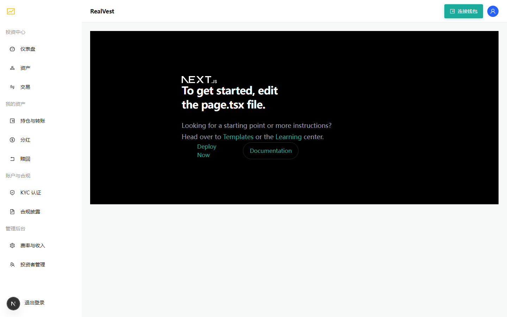
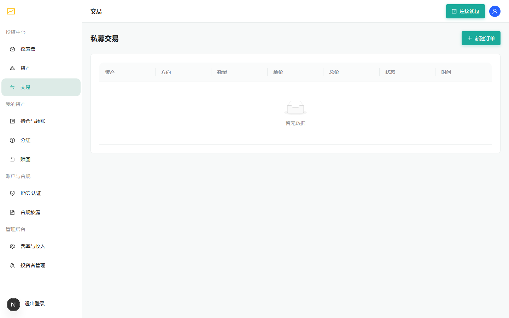
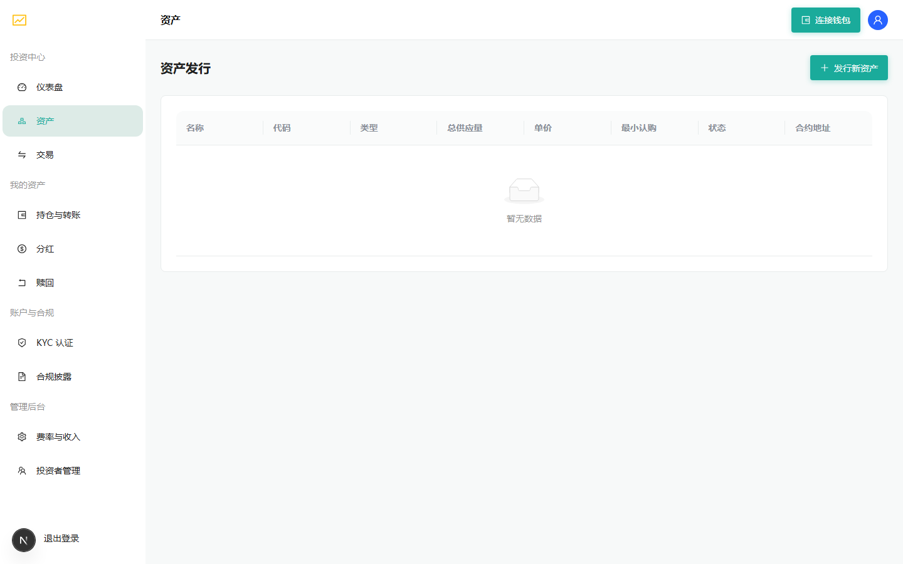

<div align="center">

# 🏦 RealVest — Compliant RWA Tokenization Platform

### Tokenize Real-World Assets. Trade with Compliance Built-In.

**ERC-3643 Security Tokens · KYC/AML · Order Book Trading · Gasless Meta-Transactions · Automated Revenue Distribution**

[](https://golang.org)
[](https://soliditylang.org)
[](https://nextjs.org)
[](./LICENSE)
[](https://github.com/likenjoy/likenjoy/actions)
[](#-tested--verified)

**A production-grade, full-stack platform to launch a compliant security-token exchange — out of the box.**

</div>

---

## 🚀 Why RealVest?

Most RWA projects fail because **compliance, trading, and asset management are built as afterthoughts**. RealVest is a complete, **compliance-first** platform where every layer — from token standards to UI — is designed for regulated security-token issuance and trading.

- ✅ **Regulator-ready**: ERC-3643 (T-REX) standard — investor identity, whitelisting, and transfer compliance on-chain
- ✅ **Complete business loop**: Issuance → KYC → Subscription → Trading → Dividends → Redemption → Revenue
- ✅ **Gasless UX**: EIP-2771 meta-transactions — your investors sign, the platform pays gas
- ✅ **Institutional-grade security**: 6-layer defense + attack simulation tested
- ✅ **10 test suites, all green** — CI-verified on every push

---

## ✨ Key Features

| | Feature | What it means for you |
|---|---|---|
| 🪪 | **ERC-3643 Compliance** | IdentityRegistry + ComplianceModule — only verified investors can hold/trade |
| 🔐 | **KYC → On-chain Identity** | Approve KYC → auto on-chain registerIdentity + whitelist |
| ⛽ | **Gasless Transactions** | EIP-2771 TrustedForwarder — investors sign, platform sponsors gas |
| 🛡️ | **Epoch Settlement** | Batch order settlement (Centrifuge-inspired) — no front-running |
| 💸 | **Revenue Distribution Token** | Linear-release yield + per-share claims (Maple-inspired) |
| 📊 | **Asset Analytics** | NAV/price curves, revenue dashboards, audit ledger |
| 💰 | **Built-in Revenue** | Mint fees, on-chain transfer fees, gas markup, ad slots |
| 🏗️ | **Full Stack** | Solidity + Go + Next.js — deploy with Docker in minutes |

---

## 📸 Screenshots

| Landing | Trading | Assets |
|---------|---------|--------|
|  |  |  |

---

## 🧪 Tested & Verified

```
✅ Contracts 37/37      ✅ API 28/28          ✅ Meta-tx E2E 12/12
✅ Ads 12/12            ✅ Transfer-fee 9/9   ✅ Epoch 9/9
✅ Lockout 4/4          ✅ Security 6/6       ✅ RDT 6/6
✅ Full-flow smoke 13/13 · Stress: 1000 req 100% success (p95 63ms)
```

**CI**: GitHub Actions — backend (Go vet+test) · contracts (Hardhat 37 tests) · frontend (tsc + build) — all green on every push.

---

## 🚀 Quick Start (Docker)

```bash
git clone https://github.com/likenjoy/likenjoy.git
cd likenjoy
cp .env.example .env        # fill in JWT_SECRET, ETH_PRIVATE_KEY, ETH_RPC_URL
docker compose up -d --build
# → http://localhost (nginx → frontend + backend)
```

> Full deployment guide: [`docs/DEPLOY.md`](docs/DEPLOY.md) · Testnet action plan: [`docs/TESTNET_ACTION.md`](docs/TESTNET_ACTION.md)

---

## 💰 License & Commercial Use

**PolyForm Noncommercial 1.0.0** — free for non-commercial use (learning, research, demo).

**Commercial use** (running your own exchange, SaaS, white-label) requires a **paid license**:

| Tier | Price | Includes |
|------|-------|----------|
| **Community** | Free | Browsing, registration, wallet connect |
| **Pro** | **$2,990/yr** (or $4,990 lifetime) | Full features + commercial license + 1yr updates + support |
| **Enterprise** | **$19,900/yr** | White-label, resale, multi-tenant + deployment support + compliance consulting |

🛒 **Buy a license** → [COMMERCIAL.md](docs/COMMERCIAL.md) · 📜 [License Agreement Template](docs/COMMERCIAL_LICENSE_AGREEMENT.md) · 📧 Contact: [GitHub @likenjoy](https://github.com/likenjoy)

```
USDT/USDC (ERC-20):  0xc71c96adcc0ef1da8ead8e5224bbbe23d25d2a05
USDT/USDC (BEP-20):  0xc71c96adcc0ef1da8ead8e5224bbbe23d25d2a05
```

---

## 📚 Documentation

- [Product Overview](docs/PROJECT_OVERVIEW.md) · [Roadmap](docs/ROADMAP.md) · [Tier Guide](docs/TIER_GUIDE.md)
- [Deployment](docs/DEPLOY.md) · [Mainnet Checklist](docs/MAINNET_CHECKLIST.md) · [KYC/Business](docs/BUSINESS_KYC.md) · [Backup](docs/BACKUP.md)
- [Commercial Guide](docs/COMMERCIAL.md) · [License Agreement](docs/COMMERCIAL_LICENSE_AGREEMENT.md)

---

## 🏛️ Architecture

```
Next.js 16 Frontend (antd 5, RainbowKit, echarts)
        │ /api
Go Gin Backend (SQLite, 40+ APIs, rate-limit, audit, health)
        │ RPC
Solidity ERC-3643 (IdentityRegistry · ComplianceModule · RWAToken · TrustedForwarder · RDT)
```

---

<div align="center">

**⭐ Star this repo if you find it useful — it helps others discover compliant RWA infrastructure.**

*⚠️ Disclaimer: This software is a technical product. Operating a security-token exchange requires appropriate licenses in your jurisdiction. Not financial advice.*

</div>
